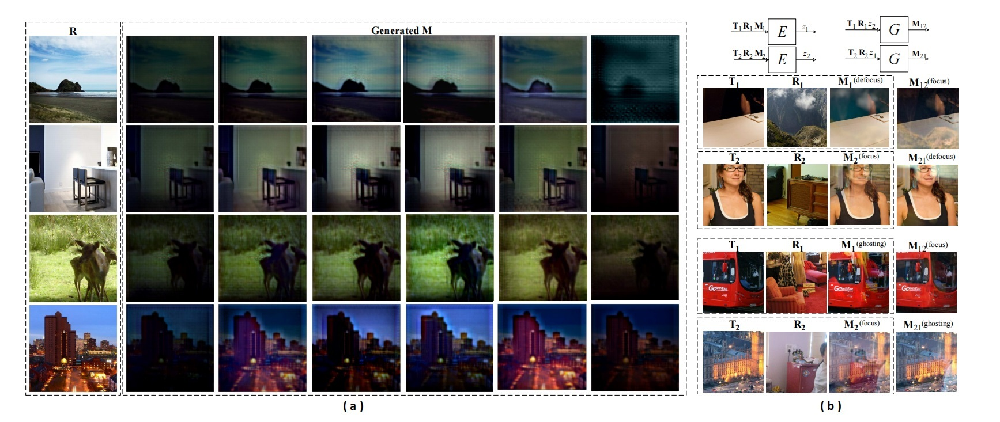
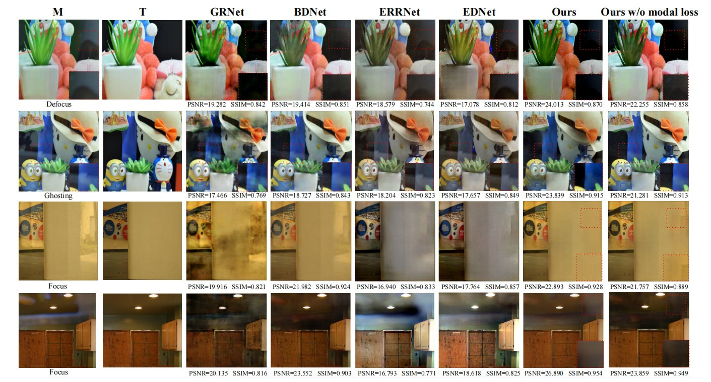

## implement of Encode Imaging System Parameters as Distribution to Improve Reflection Generation and Removal
We proposed a gan-based reflection generation an removal framework, which aims to:
1. generate multi-modal image given the transmission layer and reflective layer by altering the noise sampled from a prior distribution.
2. restore the transmission layer from reflective image.

### 1. Reflection generation
- In generation task, our model can generate images with multi-modal reflection pattern while keep faithful to the given reflection layer.
- The optical imaging process can be encoded into a prior distribution, which can be simply sampled to generate training data using the given images.

### 2. Reflection Removal

This work has been published on IEEE SPL.

W. Zhu, X. Wu, H. Chen, X. Luo and S. Zhong, "Encode Imaging System Parameters as Distribution to Improve Reflection Generation and Removal," in IEEE Signal Processing Letters, vol. 28, pp. 1360-1364, 2021, doi: 10.1109/LSP.2021.3092278.
